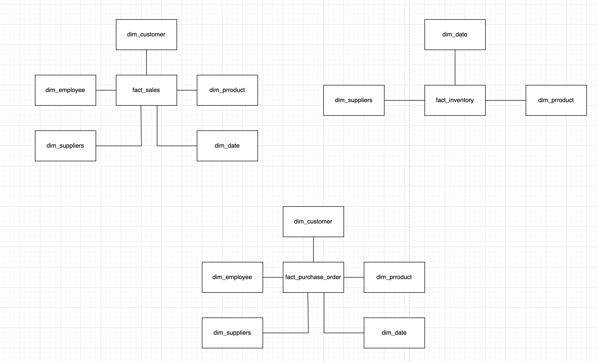
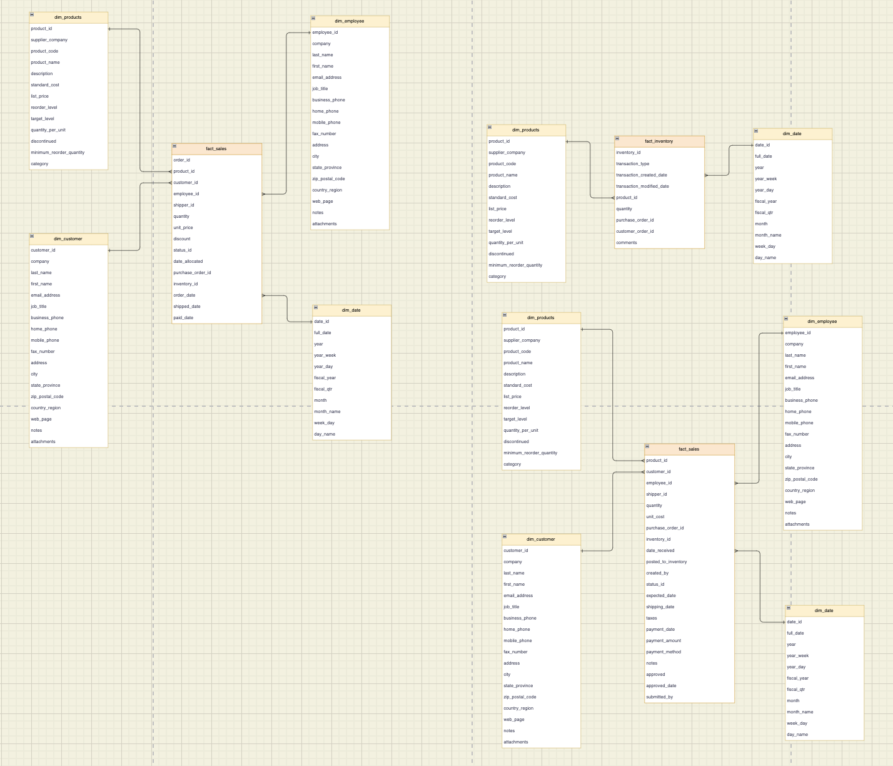
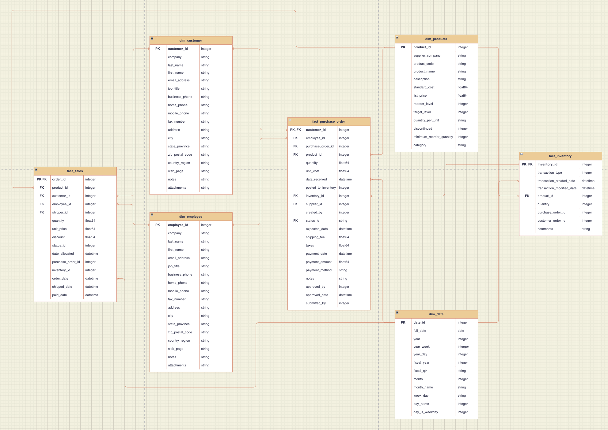
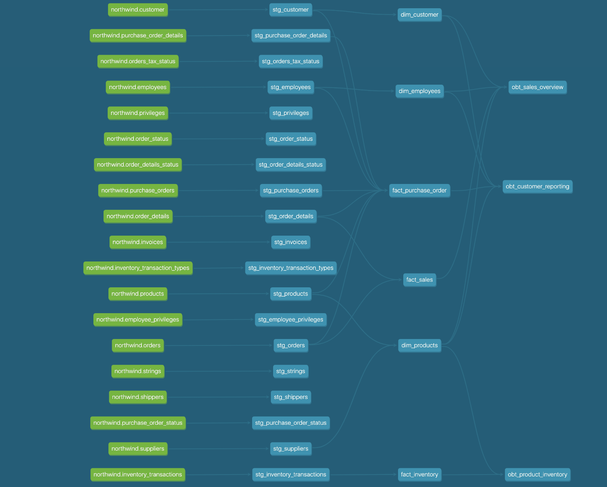

# ae-bootcamp-project

The purpose of this project to build a dimensional data warehouse in Cloud for Northwind Traders which is a fictious foods export-import company and in need of modernizing their data platform. The dataset is from the Northwind database created by Microsoft which contains all the sales transactions and purchase transactions history.

Tech stack used in this project:

- dbt
- Snowflake

## Define Use Case

### What are we trying to do?

Current

- Existing architectures are on-premise & legacy systems (MySQL database, OLTP).
- The OLTP database is used to handle both sales transactions and reporting/analytics solutions.
- The client is struggling to keep up with reporting requirements and causing database to slow down impacting their day to day business.

Future

- The client wants to modernize data and reporting solutions and move away from on-premise systems.
  
### Why are we doing it?

To achieve the following goals:

- better scalability
- reduce load on OLTP
- enhance reporting speed
- improve data security

### How are we going to achieve it?

- Migrate their existing database to Snowflake.
- Set up OLAP system for reporting.
- Need to build high priority reports first to access new system and drive adoption.
- Dimensional data warehouse to support with reporting requirements.

## Requirement Gathering

### Define Business Processes / Reporting Requirements

1. Sales Overview

   - understand better our customers:
     - what is being sold
     - what sales the most
     - where and what sales the least

2. Sales Agent Tracking

   - track sales and performance of agents to adjust commissions, reward, and empower

3. Product Inventory

   - understand the current inventory levels:
     - how to improve stock management
     - what suppliers do we have
     - how much is being purchased

4. Customer Reporting

   - allow customers to understand their purchase behaviors:
     - how much and when are they buying
     - empower them to make data-driven decisions and use the data to join their sales data

## Data Profiling

Existing tables in OLTP:

- Customers: customer buy food from the company
- Employees: works for the company
- Orders: sales order transactions between customers and Northwind
- Order Details: order details for the orders placed by customer
- Inventory Transaction: transaction details of inventories
- Products: contains current products that can be purchased
- Shippers: ships orders from Northwind to customers
- Suppliers: supply required items
- Invoices: invoice created for each other

## Data Model

### Conceptual Model



### Logical Model



### Physical Model



## Set Up Environment

Snowflake

- Sign up a 30-day free trial account [here](https://signup.snowflake.com/?utm_source=google&utm_medium=paidsearch&utm_campaign=na-ca-en-brand-core-phrase&utm_content=go-eta-evg-ss-free-trial&utm_term=c-g-snowflake-p&_bt=579189974384&_bk=snowflake&_bm=p&_bn=g&_bg=136172937588&&gclsrc=aw.ds&gclid=CjwKCAiAl-6PBhBCEiwAc2GOVA8qqVK829zl1_vZSFkI27Yyuk92YvUbfIRJK8xxA4pV86r_rwenqRoCNrYQAvD_BwE&gclsrc=aw.ds)
- Create a database `df_northwind` and a warehouse (by default called `compute_wh`) on the portal
- Inside the database, create a schema named `dl_northwind`
- Create tables and insert data by running sql scripts in a Snowflake worksheet.
  - create table schema: use `data/northwind_oltp_schema.sql`
  - insert data: use `data/northwind_oltp_data.sql`

dbt

- Set up a virtual env

```shell
# create virtual env
conda create --name <*ENV_NAME*>
# activate
conda activate <*ENV_NAME*>
# deactivate
conda deactivate
```

- Install dbt through pip, the following command will install dbt adapters for multiple cloud serivces. `dbt-snowflake` is used in this project.

```shell
pip install \
  dbt-core \
  dbt-postgres \
  dbt-redshift \
  dbt-snowflake \
  dbt-bigquery
```

- initalize the dbt project

```shell
# dbt init <*PROJECT_NAME*>
dbt init ae_bootcamp
# use `_` in naming the project
```

- connect dbt to Snowflake instance
  - if you want to change any specification, you can modify it in `.dbt/profiles.yml` in the directory where dbt is installed.

```md

You may be asked the following:
- account: (https://<this_value>.snowflakecomputing.com)
- username, password
- role: by default `accountadmin`
- warehouse: by default `compute_wh`
- database: `dl_northwind`
- schema (default schema that dbt will build objects in): <*INSERT_YOUR_DEFAULT_SCHEMA*>
```

- check the connection

```shell
dbt debug
```

## Run the Model

### Data Architecture

This dbt project has 4 layers and 3 processing phases:

- datalake -> staging
- staging -> warehouse
- warehouse -> analytics_obt (reporting layer)

The following graph shows the workflow of this project. It is generated by running command:

```shell
dbt docs generate 
dbt docs serve
```



### Useful Tips in model development

- configure [dbt_project.yml](ae-bootcamp/dbt_project.yml)

  - you can specify particular schema for each layer, the final schema will be the combination of the default schema you specified in dbt init and the schema shown in this yml file. For example, `dbt_jc_stg_northwind` is the schema of the staging layer shown in Snowflake.
  - you can materialize data as table or view and can set the rule to inidivual table.

  ```yml
  models:
    ae_bootcamp:
      staging:
        +enabled: true
        +materialized: table
        +schema: stg_northwind
      warehouse:
        +enabled: true
        +materialized: table
        +schema: dwh_northwind
        dim_date:
          +materialized: view
      analytics_obt:
        +enabled: true
        +materialized: table
        +schema: obt_northwind
  ```

- Reference source tables using Jinja template
  - specify the source table name in [source.yml](ae-bootcamp/models/staging/source.yml)
  - reference source:

  ```sql
  with source as (
      select * from {{source('northwind', 'customer')}}
  )
  select 
      *,
      current_timestamp() as ingestion_timestamp
  from source
  ```

  - for table that defined inside dbt, use `ref{{}}` instead. For example `ref{{stg_customer}}`

- Configure table paritioning (in real world fact tables are quite big)
  - for example, in [fact_sales](ae-bootcamp/models/warehouse/fact_sales.sql) table, partition by `order_date` so we can reduce the amount of data we query

```sql
{{config(
    partition_by={
        'field':'order_date',
        'date_type':'date'
    }
)}}
```

- Run SQL scripts

```shell
# run whole project
dbt run

# run a specific script:
# dbt run -m <schema>.<table>
dbt run -m warehouse.dim_customer
```

- Check data integrity
  - specify test methods in yml file. For example, in [schema.yml](ae-bootcamp/models/warehouse/schema.yml) you can test the uniqueness and not null for customer_id column in dim_customer table

  ```yml
  models:
    - name: dim_customer
      columns:
        - name: customer_id
          tests:
            - not_null
            - unique
  ```

  - run the test by typing `dbt test`

## Dependency

- python 3.9.2
- dbt: 1.0.1